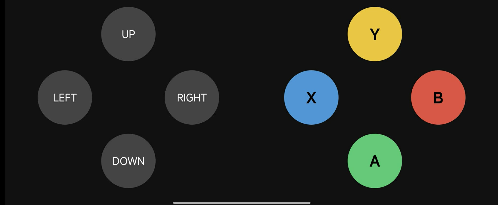

# 🤖 Robot WiFi Joy Controller (ESP8266)

โปรเจคควบคุมหุ่นยนต์ / อุปกรณ์ผ่าน Wi-Fi  
โดยใช้ **D1 mini (ESP8266)** เป็น Access Point  
ควบคุมผ่านหน้าเว็บ **Joy Controller**

---




# RikuAlice01 – WiFi Robot Gamepad FINAL v2

โปรเจกต์ควบคุมหุ่นยนต์ 2 ล้อ + เซอร์โว + รีเลย์/LED/เสียง buzzer ผ่าน WiFi  
โดยใช้ **ESP8266** (NodeMCU, Wemos D1 mini ฯลฯ) เป็น **Access Point**  
ควบคุมผ่านหน้าเว็บที่ออกแบบเหมือนจอยเกมแพด (PWA – ติดตั้งได้บนมือถือ)

## คุณสมบัติหลัก

- ควบคุมการเคลื่อนที่แบบ **pulse** (วิ่ง 200 ms แล้วหยุดอัตโนมัติ)
- ปุ่ม **Y** → Toggle เซอร์โว ระหว่าง 0° และ 90°
- ปุ่ม **A** → เปิด buzzer สั้น ๆ 100 ms
- ปุ่ม **X** และ **B** → ควบคุม output ธรรมดาแบบกดค้าง (ON/OFF)
- จำกัดการเชื่อมต่อได้ **แค่ 1 เครื่อง** เท่านั้น
- หน้าเว็บเป็น **PWA Fullscreen** (ติดตั้งบนหน้าจอหลักได้)
- มี hover + active effect (ปุ่มยุบ + เรืองแสงตอนกด)
- LED บนบอร์ดแสดงสถานะ: กระพริบตอนไม่มีคนเชื่อมต่อ / ติดเมื่อมีคนเชื่อมต่อ

## อุปกรณ์ที่ใช้

- บอร์ด ESP8266 (แนะนำ NodeMCU หรือ Wemos D1 mini)
- มอเตอร์ DC 2 ตัว + Driver L298N (หรือ TB6612FNG)
- เซอร์โว (SG90 หรือ MG90S ฯลฯ)
- Buzzer แบบ active (5V)
- Output อื่น ๆ (LED, รีเลย์, มอเตอร์เล็ก ฯลฯ) ที่ต่อกับ D6, D7
- แหล่งจ่ายไฟ 5V–12V (ขึ้นกับมอเตอร์)

## การต่อวงจร

| ขา ESP8266 | ชื่อในโค้ด     | ต่อกับอะไร                              | หมายเหตุ                              |
|------------|----------------|------------------------------------------|---------------------------------------|
| D0 (GPIO16)| IN1            | IN1 ของ L298N (มอเตอร์ซ้าย)             |                                       |
| D1 (GPIO5) | IN2            | IN2 ของ L298N (มอเตอร์ซ้าย)             |                                       |
| D2 (GPIO4) | IN3            | IN1 ของ L298N (มอเตอร์ขวา)              |                                       |
| D3 (GPIO0) | IN4            | IN2 ของ L298N (มอเตอร์ขวา)              | ระวัง pull-up อาจต้องใส่ pull-up ภายนอก |
| D5 (GPIO14)| SERVO_PIN      | สัญญาณ (signal) ของเซอร์โว              | ต่อ VCC 5V, GND ร่วมกัน               |
| D6 (GPIO12)| OUT_A2         | ฐานทรานซิสเตอร์ / IN ของรีเลย์ / LED   | ปุ่ม X – กดค้างได้                    |
| D7 (GPIO13)| OUT_A3         | เหมือนด้านบน                            | ปุ่ม B – กดค้างได้                    |
| D8 (GPIO15)| BUZZER         | ขา + ของ buzzer active                  | ต่อ GND ร่วมกัน                       |
| VIN / 5V   | —              | 5V จากแหล่งจ่าย (แนะนำ 5V 2A+)          |                                       |
| GND        | —              | GND ร่วมทุกอย่าง                         |                                       |

**ตัวอย่างการต่อมอเตอร์ (L298N):**

```
ESP8266          L298N
D0 ────────────► IN1 (Left motor)
D1 ────────────► IN2
D2 ────────────► IN3 (Right motor)
D3 ────────────► IN4

5V (จากแหล่งจ่าย) ─► VCC, 5V pin ของ L298N
GND ──────────────► GND ร่วมกัน
```

**เซอร์โว**  
- สายแดง → 5V  
- สายน้ำตาล/ดำ → GND  
- สายส้ม/เหลือง → D5

**Buzzer active**  
- ขา + → D8  
- ขา – → GND

## วิธีใช้งาน

1. อัพโหลดโค้ดนี้ไปยังบอร์ด ESP8266 โดยใช้ Arduino IDE
   - Board → NodeMCU 1.0 (ESP-12E Module) หรือบอร์ดที่ใช้
   - Port → เลือกพอร์ตที่ต่อ USB

2. ต่อวงจรตามด้านบน

3. เปิดเครื่อง → รอประมาณ 3–5 วินาที

4. เปิด WiFi บนโทรศัพท์หรือแท็บเล็ต  
   → ค้นหาเครือข่ายชื่อ **Robot-00**  
   → ใส่รหัสผ่าน **12345678**

5. เปิดเบราว์เซอร์ (Chrome / Safari แนะนำ)  
   → พิมพ์ที่อยู่ **http://192.168.1.1**

6. หน้าจอจะแสดงจอยแพด + ปุ่ม Y X B A  
   - กดปุ่มทิศทาง → หุ่นยนต์วิ่งทิศนั้น 0.2 วินาที  
   - กด Y → เซอร์โวสลับ 0° ↔ 90°  
   - กดค้าง X หรือ B → output D6/D7 จะ HIGH ตลอดเวลากด  
   - กด A → เสียง buzzer ดังสั้น ๆ

7. **ติดตั้งเป็นแอป (PWA)**  
   - บน Android: กดเมนู ⋮ ใน Chrome → เพิ่มไปยังหน้าจอหลัก  
   - เปิดจากไอคอน → จะเป็น fullscreen ไม่มีแถบเบราว์เซอร์

## 🖥️ ตัวอย่าง Serial Log

```
CMD from browser: F
CMD from browser: S
```
---

## การปรับแต่งเพิ่มเติม (แก้ในโค้ด)

- เปลี่ยนชื่อ WiFi / รหัสผ่าน  
  ```cpp
  const char* ssid     = "หุ่นยนต์ของฉัน";
  const char* password = "mypassword123";
  ```

- เปลี่ยนเวลาเคลื่อนที่ (จาก 200 ms)
  ```cpp
  actionDuration = 350;  // เปลี่ยนตรงนี้ใน startAction()
  ```

- เปลี่ยนองศาเซอร์โว
  ```cpp
  servo.write(servoState ? 120 : 10);  // เช่น เปลี่ยนเป็น 10° ↔ 120°
  ```

- อยากให้เชื่อมต่อได้มากกว่า 1 เครื่อง  
  → เปลี่ยน `WiFi.softAP(ssid, password, 1, 0, 1);` เป็น `WiFi.softAP(ssid, password);` (default 4 คน)

## ข้อควรระวัง

- D3 (GPIO0), D8 (GPIO15) มี pull-up/pull-down ในตัว อาจต้องต่อตัวต้านทานภายนอกถ้าทำงานไม่ปกติ
- ใช้แหล่งจ่ายไฟที่เพียงพอ (มอเตอร์ + ESP8266 + เซอร์โว อาจกินกระแสสูง)
- ถ้าเซอร์โวกระตุกหรือ buzzer เบา → ใช้แหล่งจ่าย 5V แยกสำหรับ logic และมอเตอร์

---

**สนุกกับการต่อหุ่นยนต์นะครับ!**  
ถ้ามีปัญหาหรืออยากเพิ่มฟีเจอร์ (เช่น ควบคุมความเร็ว, กล้อง, joystick แทนปุ่ม) บอกมาได้เลยครับ 🚀

## 📜 License
RikuAlice01
MIT License